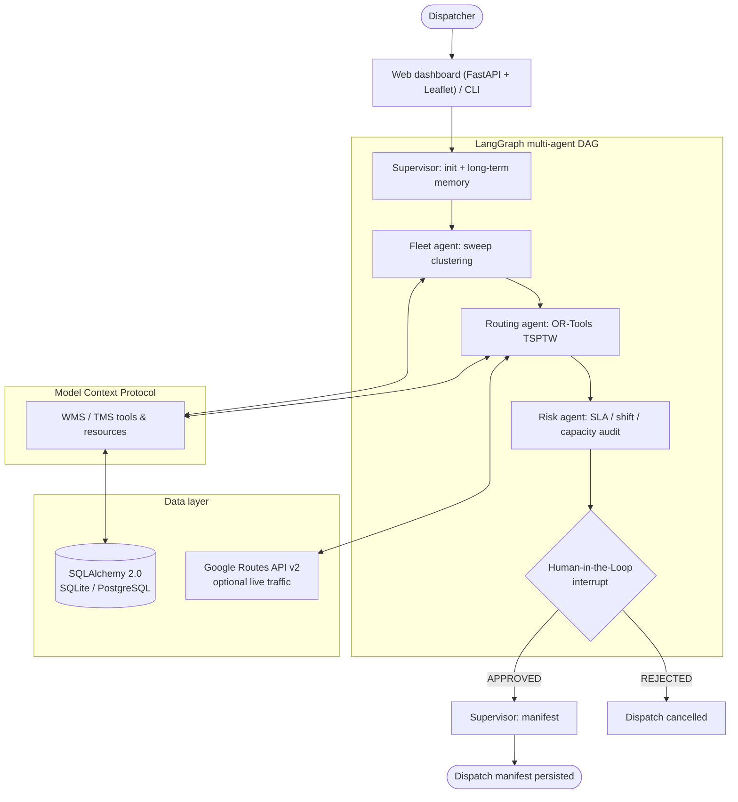

<h1 align="center">🚚 Logistics Agent Tower</h1>

<p align="center">
  <strong>Autonomous multi-agent control tower for distribution-center dispatch and route optimization.</strong><br/>
  LangGraph orchestration · Google OR-Tools CVRPTW · Model Context Protocol · Human-in-the-Loop · FastAPI dashboard
</p>

<p align="center">
  <a href="https://github.com/rodrigo85/logistics-agent-tower/actions/workflows/ci.yml"></a>
  
  <a href="https://github.com/astral-sh/ruff"></a>
  
  <a href="LICENSE"></a>
</p>

<p align="center">
  🇧🇷 <a href="README.pt-BR.md">Leia em Português</a>
</p>

---

## What it does

Every morning a cold-chain distribution center in Itajaí (SC, Brazil) has to deliver
40+ refrigerated orders to supermarkets, grocery stores, bakeries, butchers and similar
retailers with five refrigerated trucks. Each truck leaves once, at 06:00, on a
multi-stop route; customers have receiving windows and dock restrictions; drivers
must take lunch and stay inside the legal shift; and a human dispatcher signs off
when something looks risky.

This project automates that planning cycle end to end:

1. **Fleet agent** clusters nearby customers into one route per truck (geographic sweep, never above 100% capacity, VUC-only streets honoured).
2. **Routing agent** sequences each route with **Google OR-Tools** (TSP with time windows), using live traffic per leg when available, and builds the driver's itinerary (loading, stops, lunch, return).
3. **Risk agent** audits overloads, missed windows, shift limits, unallocated orders and high-value cargo.
4. **Human-in-the-Loop gate** pauses the LangGraph run and waits for an `APPROVED` / `REJECTED` verdict via API, dashboard or CLI.
5. **Supervisor** emits the electronic dispatch manifest and persists it to SQL.
6. **Dispatcher Copilot** (LLM) takes instructions such as *"não vamos atender o Bistek da Fazenda hoje"* or *"a Padaria Praia Brava agendou recebimento entre 9 e 11"*, applies them through MCP tools and re-plans.

## Highlights

| Capability | Implementation |
|------------|----------------|
| Multi-agent orchestration with pause/resume | LangGraph `StateGraph` + `interrupt()` + checkpointer; threads resumed across HTTP requests |
| Combinatorial optimisation | Sweep clustering + OR-Tools TSPTW (Guided Local Search) with haversine or Google Routes API v2 travel times |
| Tool boundary | Model Context Protocol: same tools exposed in-process to agents, over stdio to external AI clients and bound to the copilot LLM |
| Conversational agent | LangGraph tool-calling loop with short-term (thread) and long-term (SQL) memory; Ollama / Gemini / OpenAI provider factory; evaluation harness per provider |
| Persistence | SQLAlchemy 2.0, SQLite locally, PostgreSQL 16 in Docker/Cloud SQL, idempotent seeder with 56 regional customers |
| Operator UX | FastAPI + Leaflet dashboard with map, itineraries and HITL controls; Rich terminal CLI |
| Engineering hygiene | CI on Ubuntu + Windows, ruff, mypy, pytest with coverage, pre-commit, Dependabot, ADRs |
| Cloud-ready | Multi-stage non-root Docker image, Compose stack, Terraform for Cloud Run + Cloud SQL + Secret Manager + BigQuery |

<!-- Add a dashboard screenshot at docs/images/dashboard.png and uncomment:
<p align="center"></p>
-->

## Architecture



Deeper dive: [`docs/ARCHITECTURE.md`](docs/ARCHITECTURE.md) and the [ADRs](docs/adr/README.md).

## Quick start

### Windows (one click)

Double-click **`scripts\setup.bat`** (creates `.venv`, installs, seeds the database, runs the tests),
then **`scripts\run.bat`**. Or from PowerShell:

```powershell
.\scripts\setup.ps1
.\scripts\run.ps1
```

### Linux / macOS / WSL

```bash
./scripts/setup.sh && ./scripts/run.sh
# or, with make:
make venv install seed run
```

### Docker

```bash
docker compose up -d --build          # API on :8000 backed by PostgreSQL 16
docker compose --profile tools up -d  # + Adminer on :8080
```

Open **http://localhost:8000** (dashboard) and **http://localhost:8000/docs** (Swagger).

### 60-second demo through the API

```bash
# 1. Generate 40 fresh refrigerated orders for retailers in the region
curl -X POST "http://localhost:8000/api/orders/generate?count=40"

# 2. Plan the day; the run pauses at the HITL gate if risks are flagged
curl -X POST http://localhost:8000/dispatch/plan -H "content-type: application/json" \
     -d '{"cd_id":"CD-ITAJAI-SC01","auto_approve":false}'
# -> {"thread_id":"dispatch-ab12cd34","status":"AWAITING_HUMAN_APPROVAL","approval_reason":"...","risk_warnings":[...]}

# 3. Approve as the dispatcher
curl -X POST http://localhost:8000/dispatch/resume -H "content-type: application/json" \
     -d '{"thread_id":"dispatch-ab12cd34","verdict":"APPROVED","feedback":"OK with tracking"}'
# -> {"status":"COMPLETED","manifest":{"manifest_id":"MAN-...","routes":[...]}}
```

Optional: set `GOOGLE_MAPS_API_KEY` in `.env` to switch from haversine estimates to live-traffic routing.

### Talk to the copilot

```bash
# needs a tool-calling model: ollama pull qwen2.5:7b  (LLM_PROVIDER=ollama is the default)
curl -X POST http://localhost:8000/copilot/chat -H "content-type: application/json" \
     -d '{"message":"Não vamos atender o Supermercado Bistek - Fazenda hoje"}'
# -> {"reply":"...","actions":[{"tool":"skip_customer_today",...},{"tool":"replan_dispatch",...}],"replanned":true}

curl -X POST http://localhost:8000/copilot/chat -H "content-type: application/json" \
     -d '{"message":"A Padaria & Confeitaria Praia Brava agendou recebimento entre 9 e 11"}'
```

The same box lives in the dashboard (right column) and in the terminal: `logistics-tower-chat`.

## Business rules modelled

* **Cold chain only:** five refrigerated trucks (2 VUC, 2 Toco, 1 Truck); every order is chilled (0-4 °C) or frozen (-18 °C).
* **Food retail customers:** 56 supermarkets, wholesalers, grocery stores, mini-markets, bakeries, butchers, fishmongers, greengrocers and convenience stores in seven cities, each with its own receiving window and dock profile.
* **One route per truck per day:** loading 05:00-06:00, departure 06:00, up to 12 stops, 20 minutes per stop, return to the CD. No second trip.
* **Nearby stops travel together:** two-pass sweep clustering by bearing around the CD plus centroid refinement, then OR-Tools sequencing inside the route.
* **Never overload:** weight and volume hard-capped at 100%; orders that do not fit stay pending and are reported.
* **Driver shift:** mandatory 60-minute lunch after the first stop completed from 11:30, 11-hour limit (Lei 13.103/2015).
* **Long-term memory:** customer rules (e.g. "narrow street, VUC only", "perishables before 09:00") live in SQL and shape allocation.
* **Risk gate:** overloads, missed windows, shift overruns and unallocated orders require human approval; high-value cargo raises an informational alert.

## API overview

| Method | Path | Purpose |
|--------|------|---------|
| `POST` | `/dispatch/plan` | Run the agents; returns `COMPLETED` or `AWAITING_HUMAN_APPROVAL` |
| `POST` | `/dispatch/resume` | Resume a paused thread with `APPROVED` / `REJECTED` / `OVERRIDE` |
| `GET` | `/dispatch/{thread_id}` | Current state of a planning thread |
| `POST` | `/api/orders/generate?count=N` | Replace pending orders with N refrigerated orders (default 40, one per customer) |
| `POST` | `/copilot/chat` | Operator instruction in natural language; applies skips / reschedules and re-plans |
| `GET` | `/copilot/status` · `/agents` | LLM provider availability, copilot tools, agent registry |
| `GET` | `/api/vehicle/{plate}/itinerary` | Step-by-step daily itinerary for a vehicle |
| `GET` | `/api/dashboard-data` | Fleet, orders and latest routes for the map |
| `GET` | `/api/traffic/status` · `/api/traffic/route` | Google Maps integration status and traffic-aware routes |
| `GET` | `/mcp/tools` | Tools exposed to agents through MCP |
| `GET` | `/health` | Liveness, version, environment |

## Project layout

```text
.
├── src/logistics_tower/
│   ├── agents/          # supervisor, fleet, routing, risk (LangGraph nodes) + copilot (LLM tool-calling)
│   ├── llm/             # provider factory: Ollama, Gemini, OpenAI
│   ├── api/             # app factory, routers per context, schemas, dashboard template
│   ├── db/              # SQLAlchemy models, repository, idempotent seeder, customer pool, order factory
│   ├── mcp/             # MCP tools, in-process client, stdio server
│   ├── memory/          # short-term checkpointer, long-term customer rules
│   ├── services/        # sweep clustering, OR-Tools TSPTW routing, WMS, Google Maps traffic
│   ├── graph.py         # DAG wiring + HITL gate
│   ├── state.py         # typed graph state
│   ├── config.py        # 12-factor settings
│   └── cli.py           # Rich terminal dispatcher
├── tests/               # pytest suite (unit + opt-in integration)
├── evals/               # LLM evaluation cases and runner (make eval)
├── docs/                # ARCHITECTURE.md, ADRs
├── docker/              # multi-stage Dockerfile
├── infra/terraform/gcp/ # Cloud Run, Cloud SQL, Artifact Registry, BigQuery, Secret Manager
├── scripts/             # setup/run launchers (bash, PowerShell, bat), fixture export
├── data/samples/        # reference fixtures
├── .github/             # CI workflow, Dependabot, issue/PR templates
├── Makefile · pyproject.toml · docker-compose.yml · .pre-commit-config.yaml
```

## Quality gates

```bash
make lint        # ruff check
make typecheck   # mypy
make test        # pytest (network-free)
make test-all    # + Google Maps integration tests (needs GOOGLE_MAPS_API_KEY)
make cov         # coverage report (threshold 70%)
make check       # everything CI runs
```

CI runs on every push and pull request: lint + mypy, the test matrix
(Ubuntu and Windows × Python 3.10 and 3.12), a Docker image build and
`terraform validate`.

## Configuration

Copy `.env.example` to `.env`. The most relevant settings:

| Variable | Default | Effect |
|----------|---------|--------|
| `DATABASE_URL` | *(empty → SQLite)* | Any SQLAlchemy URL, e.g. `postgresql+psycopg://…` |
| `GOOGLE_MAPS_API_KEY` | *(empty)* | Enables Routes API v2 live traffic |
| `LLM_PROVIDER` | `ollama` | Copilot backend: `ollama` (`OLLAMA_MODEL`), `gemini` (`GOOGLE_API_KEY`), `openai` (`OPENAI_API_KEY`) |
| `HITL_AUTO_APPROVE` | `false` | Skip the human gate (pipelines, demos) |
| `MAX_STOPS_PER_VEHICLE` | `12` | Deliveries per route |
| `DOCK_START_TIME` | `05:00` | Loading start; departure one hour later |
| `MAX_WEIGHT_THRESHOLD_PERCENT` | `100.0` | Utilisation above which the risk agent flags an overload |
| `LOG_LEVEL` | `INFO` | Root logging level |

## Deployment

* **Docker Compose:** `docker compose up -d --build` starts PostgreSQL and the API (non-root image, health check).
* **Google Cloud:** `cd infra/terraform/gcp && terraform init && terraform apply` provisions Artifact Registry,
  Cloud SQL (PostgreSQL 16), Secret Manager (database URL), BigQuery telemetry dataset and a Cloud Run service
  (2 vCPU / 4 GiB). Push the image to the registry and Cloud Run picks it up.

## Roadmap

- [x] LLM copilot that applies operator instructions and re-plans (v1.3.0)
- [ ] Copilot streaming responses and voice input in the dashboard
- [ ] Multi-vehicle CVRP in OR-Tools (global rebalancing across trucks) and lunch modelled as a solver break
- [ ] `PostgresSaver` checkpointer for multi-instance deployments
- [ ] Alembic migrations
- [ ] Route telemetry export to BigQuery
- [ ] Authentication (OIDC) in front of the API

## Documentation

* [Architecture](docs/ARCHITECTURE.md) · [ADRs](docs/adr/README.md) · [LLM evaluation](docs/LLM_EVALUATION.md) · [Contributing](CONTRIBUTING.md) · [Changelog](CHANGELOG.md) · [Security](SECURITY.md)

## License

MIT © [Rodrigo Andreatta da Costa](https://github.com/rodrigo85)
