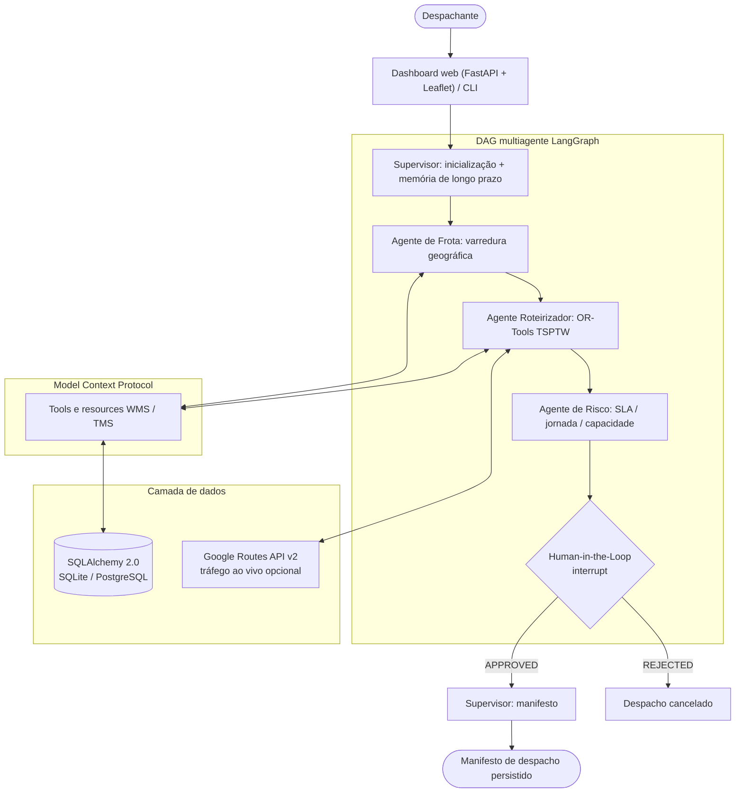

<h1 align="center">🚚 Logistics Agent Tower</h1>

<p align="center">
  <strong>Torre de controle multiagente para expedição de Centro de Distribuição e otimização de rotas.</strong><br/>
  Orquestração LangGraph · Google OR-Tools CVRPTW · Model Context Protocol · Human-in-the-Loop · Dashboard FastAPI
</p>

<p align="center">
  <a href="https://github.com/rodrigo85/logistics-agent-tower/actions/workflows/ci.yml"></a>
  
  <a href="https://github.com/astral-sh/ruff"></a>
  
  <a href="LICENSE"></a>
</p>

<p align="center">
  🇺🇸 <a href="README.md">Read in English</a>
</p>

---

## O que o sistema faz

Todo dia, um Centro de Distribuição frigorífico em Itajaí (SC) precisa entregar mais de 40 pedidos
refrigerados a supermercados, mercearias, padarias, açougues e similares com cinco caminhões
frigoríficos. Cada caminhão sai uma única vez, às 06:00, em uma rota com múltiplas paradas; os
clientes têm janelas de recebimento e restrições de doca; os motoristas precisam almoçar e ficar
dentro da jornada legal; e um despachante humano aprova quando algo parece arriscado.

O projeto automatiza esse ciclo de ponta a ponta:

1. **Agente de Frota** agrupa clientes próximos em uma rota por caminhão (varredura geográfica, nunca acima de 100% da capacidade, ruas "somente VUC" respeitadas).
2. **Agente Roteirizador** sequencia cada rota com **Google OR-Tools** (TSP com janelas de tempo), usa tráfego ao vivo por trecho quando disponível e monta o itinerário do motorista (carregamento, paradas, almoço, retorno).
3. **Agente de Risco** audita sobrecarga, janelas perdidas, limite de jornada, pedidos sem veículo e cargas de alto valor.
4. **Gate Human-in-the-Loop** pausa a execução do LangGraph e aguarda o veredito `APPROVED` / `REJECTED` via API, dashboard ou CLI.
5. **Supervisor** emite o manifesto eletrônico de despacho e o persiste em SQL.
6. **Copiloto do Despachante** (LLM) recebe instruções como *"não vamos atender o Bistek da Fazenda hoje"* ou *"a Padaria Praia Brava agendou recebimento entre 9 e 11"*, aplica-as via tools MCP e replaneja.

## Destaques

| Capacidade | Implementação |
|------------|---------------|
| Orquestração multiagente com pausa/retomada | LangGraph `StateGraph` + `interrupt()` + checkpointer; threads retomadas entre requisições HTTP |
| Otimização combinatória | Clusterização por varredura + OR-Tools TSPTW (Guided Local Search) com tempos por haversine ou Google Routes API v2 |
| Fronteira de ferramentas | Model Context Protocol: as mesmas tools expostas in-process aos agentes, via stdio a clientes de IA externos e vinculadas ao LLM do copiloto |
| Agente conversacional | Loop de tool calling em LangGraph com memória de curto prazo (thread) e longo prazo (SQL); fábrica de provedores Ollama / Gemini / OpenAI; harness de avaliação por provedor |
| Persistência | SQLAlchemy 2.0, SQLite local, PostgreSQL 16 em Docker/Cloud SQL, seeder idempotente com 56 clientes regionais |
| Experiência do operador | Dashboard FastAPI + Leaflet com mapa, itinerários e controles HITL; CLI em Rich |
| Higiene de engenharia | CI em Ubuntu + Windows, ruff, mypy, pytest com cobertura, pre-commit, Dependabot, ADRs |
| Pronto para nuvem | Imagem Docker multi-stage sem root, stack Compose, Terraform para Cloud Run + Cloud SQL + Secret Manager + BigQuery |

<!-- Adicione uma captura do dashboard em docs/images/dashboard.png e descomente:
<p align="center"></p>
-->

## Arquitetura



Detalhes em [`docs/ARCHITECTURE.md`](docs/ARCHITECTURE.md) e nos [ADRs](docs/adr/README.md) (em inglês).

## Início rápido

### Windows (um clique)

Dê dois cliques em **`scripts\setup.bat`** (cria a `.venv`, instala, popula o banco e roda os testes)
e depois em **`scripts\run.bat`**. Ou pelo PowerShell:

```powershell
.\scripts\setup.ps1
.\scripts\run.ps1
```

### Linux / macOS / WSL

```bash
./scripts/setup.sh && ./scripts/run.sh
# ou, com make:
make venv install seed run
```

### Docker

```bash
docker compose up -d --build          # API na porta 8000 com PostgreSQL 16
docker compose --profile tools up -d  # + Adminer na porta 8080
```

Abra **http://localhost:8000** (dashboard) e **http://localhost:8000/docs** (Swagger).

### Demo de 60 segundos pela API

```bash
# 1. Gera 40 pedidos refrigerados para varejistas da região
curl -X POST "http://localhost:8000/api/orders/generate?count=40"

# 2. Planeja o dia; a execução pausa no gate HITL se houver riscos
curl -X POST http://localhost:8000/dispatch/plan -H "content-type: application/json" \
     -d '{"cd_id":"CD-ITAJAI-SC01","auto_approve":false}'
# -> {"thread_id":"dispatch-ab12cd34","status":"AWAITING_HUMAN_APPROVAL","approval_reason":"...","risk_warnings":[...]}

# 3. Aprova como despachante
curl -X POST http://localhost:8000/dispatch/resume -H "content-type: application/json" \
     -d '{"thread_id":"dispatch-ab12cd34","verdict":"APPROVED","feedback":"OK com rastreamento"}'
# -> {"status":"COMPLETED","manifest":{"manifest_id":"MAN-...","routes":[...]}}
```

Opcional: defina `GOOGLE_MAPS_API_KEY` no `.env` para trocar a estimativa haversine por roteirização com tráfego ao vivo.

### Conversando com o copiloto

```bash
# precisa de um modelo com tool calling: ollama pull qwen2.5:7b  (LLM_PROVIDER=ollama é o padrão)
curl -X POST http://localhost:8000/copilot/chat -H "content-type: application/json" \
     -d '{"message":"Não vamos atender o Supermercado Bistek - Fazenda hoje"}'
# -> {"reply":"...","actions":[{"tool":"skip_customer_today",...},{"tool":"replan_dispatch",...}],"replanned":true}

curl -X POST http://localhost:8000/copilot/chat -H "content-type: application/json" \
     -d '{"message":"A Padaria & Confeitaria Praia Brava agendou recebimento entre 9 e 11"}'
```

A mesma caixa de texto existe no dashboard (coluna da direita) e no terminal: `logistics-tower-chat`.

## Regras de negócio modeladas

* **Somente cadeia fria:** cinco caminhões frigoríficos (2 VUC, 2 Toco, 1 Truck); todo pedido é resfriado (0-4 °C) ou congelado (-18 °C).
* **Clientes do varejo alimentar:** 56 supermercados, atacadistas, mercearias, minimercados, padarias, açougues, peixarias, hortifrutis e conveniências em sete cidades, cada um com janela de recebimento e perfil de doca próprios.
* **Uma rota por caminhão por dia:** carregamento 05:00-06:00, saída às 06:00, até 12 paradas, 20 minutos por parada, retorno ao CD. Sem segunda viagem.
* **Paradas próximas viajam juntas:** varredura em duas passagens por ângulo em torno do CD com refinamento por centróide e, dentro da rota, sequenciamento pelo OR-Tools.
* **Nunca sobrecarrega:** peso e volume com teto rígido de 100%; pedidos que não cabem ficam pendentes e são reportados.
* **Jornada do motorista:** almoço obrigatório de 60 min após a primeira entrega concluída a partir das 11:30, limite de 11 h (Lei 13.103/2015).
* **Memória de longo prazo:** regras do cliente (ex.: "rua estreita, somente VUC", "perecíveis até 09:00") ficam em SQL e moldam a alocação.
* **Gate de risco:** sobrecarga, janelas perdidas, jornada excedida e pedidos sem veículo exigem aprovação humana; carga de alto valor gera alerta informativo.

## Visão geral da API

| Método | Rota | Finalidade |
|--------|------|------------|
| `POST` | `/dispatch/plan` | Executa os agentes; retorna `COMPLETED` ou `AWAITING_HUMAN_APPROVAL` |
| `POST` | `/dispatch/resume` | Retoma uma thread pausada com `APPROVED` / `REJECTED` / `OVERRIDE` |
| `GET` | `/dispatch/{thread_id}` | Estado atual de uma thread de planejamento |
| `POST` | `/api/orders/generate?count=N` | Substitui os pedidos pendentes por N pedidos refrigerados (padrão 40, um por cliente) |
| `POST` | `/copilot/chat` | Instrução do operador em linguagem natural; aplica exclusões / reagendamentos e replaneja |
| `GET` | `/copilot/status` · `/agents` | Disponibilidade do provedor LLM, tools do copiloto, registro de agentes |
| `GET` | `/api/vehicle/{placa}/itinerary` | Itinerário diário passo a passo de um veículo |
| `GET` | `/api/dashboard-data` | Frota, pedidos e últimas rotas para o mapa |
| `GET` | `/api/traffic/status` · `/api/traffic/route` | Status da integração Google Maps e rotas com tráfego |
| `GET` | `/mcp/tools` | Tools expostas aos agentes via MCP |
| `GET` | `/health` | Liveness, versão, ambiente |

## Estrutura do projeto

```text
.
├── src/logistics_tower/
│   ├── agents/          # supervisor, frota, roteirização, risco (nós LangGraph) + copiloto (LLM com tool calling)
│   ├── llm/             # fábrica de provedores: Ollama, Gemini, OpenAI
│   ├── api/             # app factory, routers por contexto, schemas, template do dashboard
│   ├── db/              # modelos SQLAlchemy, repositório, seeder idempotente, pool de clientes, fábrica de pedidos
│   ├── mcp/             # tools MCP, cliente in-process, servidor stdio
│   ├── memory/          # checkpointer de curto prazo, regras de cliente de longo prazo
│   ├── services/        # varredura geográfica, roteirização OR-Tools TSPTW, WMS, tráfego Google Maps
│   ├── graph.py         # montagem do DAG + gate HITL
│   ├── state.py         # estado tipado do grafo
│   ├── config.py        # configurações 12-factor
│   └── cli.py           # despachante em terminal (Rich)
├── tests/               # suíte pytest (unitários + integração opcional)
├── evals/               # casos e runner de avaliação de LLMs (make eval)
├── docs/                # ARCHITECTURE.md, ADRs
├── docker/              # Dockerfile multi-stage
├── infra/terraform/gcp/ # Cloud Run, Cloud SQL, Artifact Registry, BigQuery, Secret Manager
├── scripts/             # launchers de setup/run (bash, PowerShell, bat), exportação de fixtures
├── data/samples/        # fixtures de referência
├── .github/             # workflow de CI, Dependabot, templates de issue/PR
├── Makefile · pyproject.toml · docker-compose.yml · .pre-commit-config.yaml
```

## Portões de qualidade

```bash
make lint        # ruff check
make typecheck   # mypy
make test        # pytest (sem rede)
make test-all    # + testes de integração Google Maps (exige GOOGLE_MAPS_API_KEY)
make cov         # relatório de cobertura (mínimo 70%)
make check       # tudo que o CI executa
```

O CI roda a cada push e pull request: lint + mypy, matriz de testes
(Ubuntu e Windows × Python 3.10 e 3.12), build da imagem Docker e `terraform validate`.

## Configuração

Copie `.env.example` para `.env`. As variáveis mais relevantes:

| Variável | Padrão | Efeito |
|----------|--------|--------|
| `DATABASE_URL` | *(vazio → SQLite)* | Qualquer URL SQLAlchemy, ex.: `postgresql+psycopg://…` |
| `GOOGLE_MAPS_API_KEY` | *(vazio)* | Habilita tráfego ao vivo via Routes API v2 |
| `LLM_PROVIDER` | `ollama` | Backend do copiloto: `ollama` (`OLLAMA_MODEL`), `gemini` (`GOOGLE_API_KEY`), `openai` (`OPENAI_API_KEY`) |
| `HITL_AUTO_APPROVE` | `false` | Pula o gate humano (pipelines, demos) |
| `MAX_STOPS_PER_VEHICLE` | `12` | Entregas por rota |
| `DOCK_START_TIME` | `05:00` | Início do carregamento; saída uma hora depois |
| `MAX_WEIGHT_THRESHOLD_PERCENT` | `100.0` | Ocupação acima da qual o agente de risco sinaliza sobrecarga |
| `LOG_LEVEL` | `INFO` | Nível de log raiz |

## Deploy

* **Docker Compose:** `docker compose up -d --build` sobe PostgreSQL e a API (imagem sem root, health check).
* **Google Cloud:** `cd infra/terraform/gcp && terraform init && terraform apply` provisiona Artifact Registry,
  Cloud SQL (PostgreSQL 16), Secret Manager (URL do banco), dataset BigQuery de telemetria e um serviço Cloud Run
  (2 vCPU / 4 GiB). Publique a imagem no registry e o Cloud Run a utiliza.

## Roadmap

- [x] Copiloto com LLM que aplica instruções do despachante e replaneja (v1.3.0)
- [ ] Respostas em streaming e entrada por voz no dashboard
- [ ] CVRP multiveículo no OR-Tools (rebalanceamento global entre caminhões) e almoço modelado como pausa do solver
- [ ] Checkpointer `PostgresSaver` para deploy com múltiplas instâncias
- [ ] Migrações com Alembic
- [ ] Exportação de telemetria de rotas para o BigQuery
- [ ] Autenticação (OIDC) na frente da API

## Documentação

* [Arquitetura](docs/ARCHITECTURE.md) · [ADRs](docs/adr/README.md) · [Avaliação de LLMs](docs/LLM_EVALUATION.md) · [Contribuindo](CONTRIBUTING.md) · [Changelog](CHANGELOG.md) · [Segurança](SECURITY.md)

## Licença

MIT © [Rodrigo Andreatta da Costa](https://github.com/rodrigo85)
