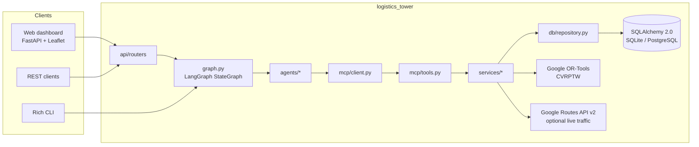
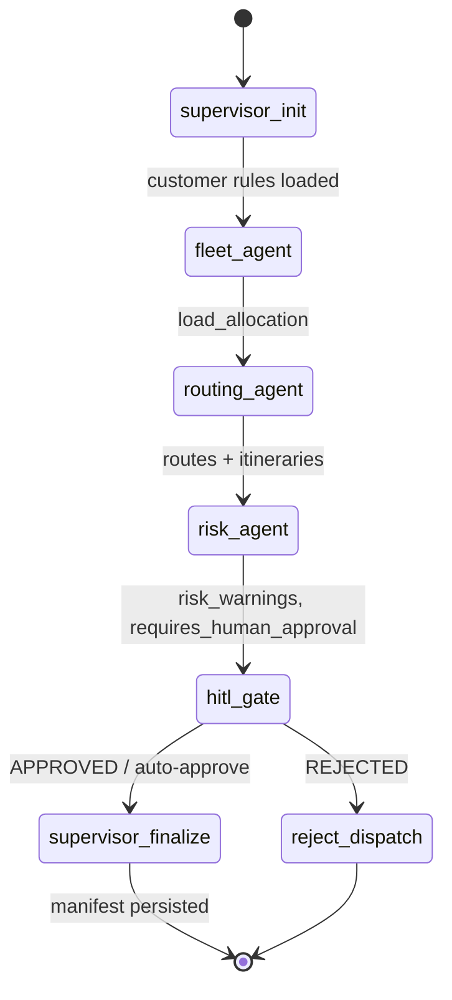
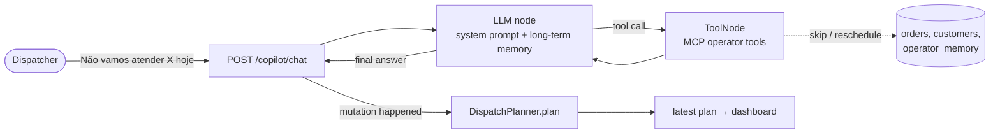

# Architecture

This document describes how the Logistics Agent Tower is put together, which
decisions shape it, and where to look when you need to change something.
Design decisions with lasting consequences are recorded as ADRs in [`adr/`](adr/).

## 1. Problem statement

A distribution center (CD) in Itajaí, Santa Catarina, distributes refrigerated
goods to food retailers (supermarkets, wholesalers, grocery stores, bakeries,
butchers, fishmongers, greengrocers, convenience stores) with a fleet of five
refrigerated trucks. Every morning, 40+ small orders must be **clustered into
one multi-stop route per truck**, sequenced to respect each customer's receiving
window and dock restrictions, and timed inside the legal driver shift (loading
at 05:00, mandatory one-hour lunch, 11-hour limit).

The system plans that day automatically and pauses for a human dispatcher
whenever the plan carries operational risk.

## 2. High-level view



## 3. Layers and responsibilities

| Layer | Package | Responsibility | Depends on |
|-------|---------|----------------|------------|
| Presentation | `api/` (routers, schemas, app factory), `cli.py`, `chat_cli.py`, `api/templates/` | HTTP contract, dashboard (map + copilot chat), terminal UX | orchestration |
| Orchestration | `graph.py`, `state.py`, `agents/`, `services/dispatch_service.py` | LangGraph DAG, shared state, specialist agent nodes, HITL gate, dispatch planner; `agents/copilot.py` is the LLM tool-calling agent | tool boundary |
| Tool boundary | `mcp/` | Model Context Protocol server (stdio) and in-process client used by agents | services |
| Domain services | `services/` | Sweep clustering (`fleet_service`), OR-Tools TSPTW + itinerary (`routing_service`), WMS read model, Google Maps traffic | data access |
| Memory | `memory/`, `db` tables `customer_rules`, `operator_memory` | Short-term checkpointers (planning threads, chat threads) and long-term customer rules / operator notes / window overrides in SQL | data access |
| LLM | `llm/` | Provider factory (Ollama, Gemini, OpenAI) and availability diagnostics | - |
| Data access | `db/` | SQLAlchemy models, repository, idempotent seeder, regional customer pool, order factory | database |
| Cross-cutting | `config.py`, `logging_setup.py` | 12-factor settings, logging bootstrap | - |

Dependencies point downward only. Agents never import SQLAlchemy; routers never
call services directly except for read-only dashboard feeds.

## 4. The agent graph



| Node | Input | Output | Notes |
|------|-------|--------|-------|
| `supervisor_init` | `cd_id` | `customer_rules` | Pulls long-term memory (dock rules, access restrictions) from SQL. |
| `fleet_agent` | pending orders, fleet, rules | `load_allocation`, `unallocated_orders` | Sweep clustering by polar angle around the CD; one route per truck; hard 100% capacity guard; VUC-only customers honoured. |
| `routing_agent` | `load_allocation` | `routes` | Calls the `optimize_vehicle_route` tool per vehicle: OR-Tools TSPTW sequencing, timeline with waits and lunch, itinerary. |
| `risk_agent` | loads + routes | `risk_warnings`, `requires_human_approval` | Overload, SLA breach, shift limit, unallocated orders (HITL) and high-value cargo (info). |
| `hitl_gate` | state | `human_verdict` | `interrupt()` pauses the graph; state is checkpointed until `/dispatch/resume`. |
| `supervisor_finalize` | everything | `dispatch_manifest` | Confirms via MCP tool, persists the manifest and marks orders `DISPATCHED`. |

State is a `TypedDict` (`state.py`). Every node returns a partial update; the
`execution_log` list is appended by each node so the UI can show the audit trail.

## 4b. The Dispatcher Copilot



* The model only acts through tools; customer resolution, window parsing and the
  "re-plan after a mutation" rule are deterministic code, not prompt hopes.
* Ambiguous names (chains with several stores) return `AMBIGUOUS` and the model
  asks which store; nothing is mutated.
* Dates are parsed by code (`dates.parse_delivery_date`): the model passes "amanhã",
  "quinta" or "27/09" verbatim; every day touched by a mutation is re-planned.
* Chat threads have their own checkpointer; long-term memory is SQL.
* Provider quality is measured by `evals/run_evals.py` (see `docs/LLM_EVALUATION.md`).

## 5. Human-in-the-Loop contract

1. `POST /dispatch/plan` runs the graph. If `requires_human_approval` is true and
   `HITL_AUTO_APPROVE` is false, LangGraph raises an interrupt and the response
   is `AWAITING_HUMAN_APPROVAL` with the reason and warnings.
2. The thread lives in the checkpointer keyed by `thread_id`.
3. `POST /dispatch/resume` sends `Command(resume={"verdict", "feedback"})`.
   `APPROVED`/`OVERRIDE` finalize; `REJECTED` cancels and persists a `REJECTED` manifest.
4. `GET /dispatch/{thread_id}` returns the current snapshot at any time.

The in-memory checkpointer is intentional for a single-process deployment. For
horizontal scaling swap `memory/short_term.py` for `PostgresSaver` (see ADR-0001).

## 6. Routing and time model

* **Clustering (sweep + refinement):** two-pass sweep by bearing around the CD
  (VUC-only customers over the VUC trucks first, the rest over the large trucks),
  each truck taking a contiguous sector until weight, volume or
  `MAX_STOPS_PER_VEHICLE` is reached; leftovers join the nearest route; then
  k-means-style relocation of stops towards clearly closer route centroids.
* **Sequencing (OR-Tools):** single-vehicle TSP with time windows. Lower bounds
  are hard (the truck waits for the window to open), upper bounds are soft
  (penalty per late minute); arc cost is distance; Guided Local Search for routes
  with more than 8 stops, sub-second time limits.
* **Timeline:** loading 05:00-06:00, 20-minute service per stop, lunch inserted
  after the first stop completed at or after 11:30 (or at the CD after the return),
  return leg, shift end. Shifts above 11 h are flagged `SHIFT_LIMIT`.
* **Travel time:** Google Routes API v2 per leg (`TRAFFIC_AWARE`, cached for
  `GOOGLE_MAPS_CACHE_TTL_SECONDS`) when configured; otherwise haversine x
  `ROAD_CIRCUITY_FACTOR` at `URBAN_SPEED_KMH`. The solver matrix always uses
  haversine to avoid N² API calls.

## 7. Data model

```mermaid
erDiagram
    customers ||--o{ customer_rules : has
    customers ||--o{ orders : places
    fleet
    dispatch_manifests
    customers { int id PK; string code UK; string name; string segment; float lat; float lng; string dock_type; string max_vehicle_allowed }
    customer_rules { int id PK; int customer_id FK; string rule_category; text content; string priority }
    orders { int id PK; string order_number UK; int customer_id FK; string cd_id; float weight_kg; float volume_m3; string temperature_regime; string window_start; string window_end; string status }
    fleet { int id PK; string vehicle_id UK; string plate UK; string vehicle_type; float max_weight_kg; float max_volume_m3; string home_cd_id }
    dispatch_manifests { int id PK; string manifest_id UK; datetime created_at; string status; string human_verdict; text manifest_payload_json }
```

Orders carry a `delivery_date`; the WMS keeps a rolling horizon of `PLANNING_HORIZON_DAYS`
(3) days and every plan, cache and manifest is scoped to one day.

The seeder is idempotent: it converges the fleet to the five refrigerated trucks,
inserts missing customers from `address_pool.py` (56 food retailers across seven
cities), rebuilds the local database when the schema drifted, and regenerates the
40 seed orders (fixed RNG, `order_factory.py`) only when the pending set is empty
or inconsistent. `POST /api/orders/generate` uses the same factory with a fresh RNG.

## 8. Configuration

All knobs live in `config.Settings` and are documented in `.env.example`. Tests
override `DATABASE_URL` with a temporary SQLite file before the package is
imported (see `tests/conftest.py`), so the developer database is never touched.

## 9. Deployment topology

| Environment | Database | Runner | Notes |
|-------------|----------|--------|-------|
| Local | SQLite (`data/logistics.db`) | `scripts/run.*`, `make run` | Auto-reload, seeded on startup. |
| Docker Compose | PostgreSQL 16 | `docker compose up` | API container + Postgres (+ Adminer with `--profile tools`). |
| GCP | Cloud SQL PostgreSQL 16 | Cloud Run (2 vCPU / 4 GiB) | Terraform in `infra/terraform/gcp`; DB URL injected from Secret Manager; BigQuery dataset for telemetry. |

## 10. Known limitations and roadmap

* Planning agents are deterministic by design; the only LLM is the copilot
  (ADR-0007). Its quality depends on the provider; small local models may need
  the operator to rephrase.
* The MCP server module (`mcp/server.py`) requires the `mcp` extra and is
  exercised manually (stdio), not by the unit suite.
* Single-process checkpointer; no auth on the API (intended to sit behind an
  identity-aware proxy such as Cloud Run IAM / IAP).
* Telemetry export to BigQuery is provisioned but not yet wired from the app.
